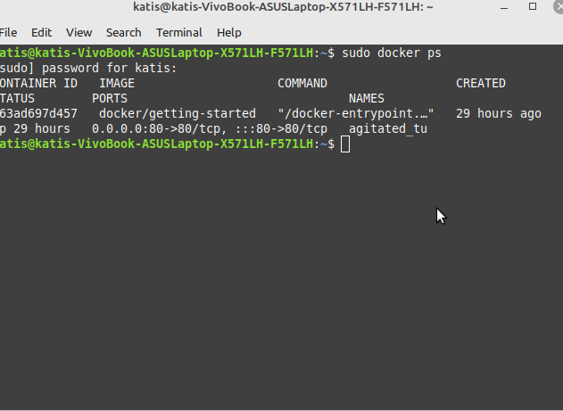
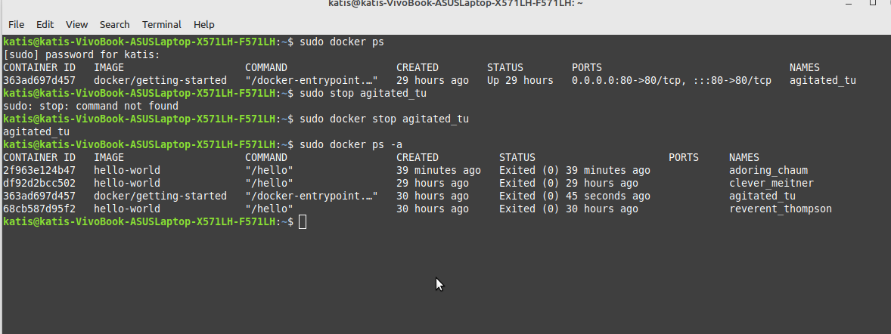

1. Install Docker Engine on Ubuntu
(Установка Docker Engine в Ubuntu)

Update the apt package index and install packages to allow apt to use a repository over HTTPS:
(Обновите apt и установите пакеты, позволяюшие apt использовать репозиторий через HTTPS)

 sudo apt-get update
 sudo apt-get install \
    ca-certificates \
    curl \
    gnupg \

Add Docker’s official GPG key:
(Добавьте официальный GPG-ключ Docker)

sudo mkdir -m 0755 -p /etc/apt/keyrings
curl -fsSL https://download.docker.com/linux/ubuntu/gpg | sudo gpg --dearmor -o /etc/apt/keyrings/docker.gpg

Use the following command to set up the repository:
(Настройте репозиторий следующей командой)

echo \
  "deb [arch=$(dpkg --print-architecture) signed-by=/etc/apt/keyrings/docker.gpg] https://download.docker.com/linux/ubuntu \
  $(lsb_release -cs) stable" | sudo tee /etc/apt/sources.list.d/docker.list > /dev/null
  

Update the apt package index:
(Обновите apt)

sudo apt-get update

To install the latest version, run:
(Для установки последней версии, введите)

sudo apt-get install docker-ce docker-ce-cli containerd.io docker-buildx-plugin docker-compose-plugin

Verify that the Docker Engine installation is successful by running the hello-world image (This command downloads a test image and runs it in a container. When the container runs, it prints a confirmation message and exits):
(Убедитесь что установка Docker Engine прошла успешно, запустив hello-world image)

sudo docker run hello-world

2. So, let's run a container. (As we haven't add a user to group, we have to write sudo or go to sudo mode using "sudo -i"):
(Запускаем контейнер через "sudo -i", т.к. пользователь не добавлен в группу => у него нет прав)

sudo -i
docker run -d -p 80:80 docker/getting-started

2.5 "sudo docker ps" is in "5. Useful commands"
(Пункт 2.5 про команду "sudo docker ps" находится в пункте 5. "Полезные команды")

3. Finally, go to the localhost:
(Идем на localhost)

4. Here is an instruction for downloading Docker Desktop. I've done it:
(На localhost видим инструкцию для установки Docker Desktop. Я его установила)

5. Useful commands:
(Полезные команды)

sudo docker images

sudo docker ps

To stop the container, type "sudo docker stop <container_NAME> (you can get <container_NAME> running "sudo docker ps"). Then the status of containers can be seen with "sudo docker ps -a":
(Команда остановки контейнера)

