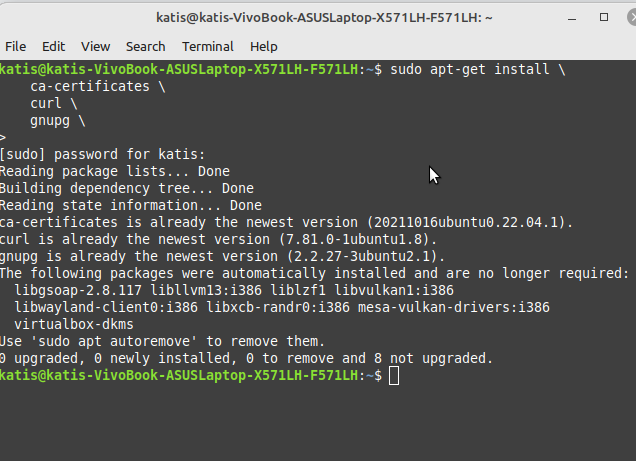
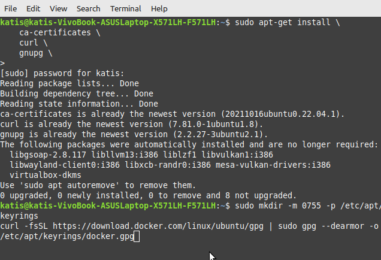
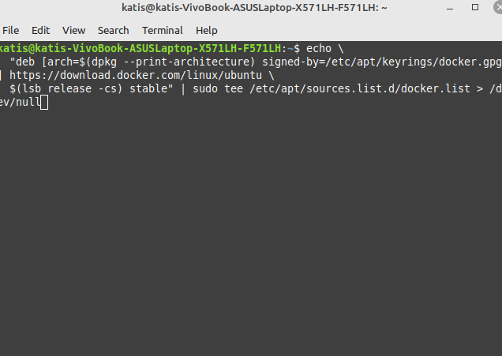
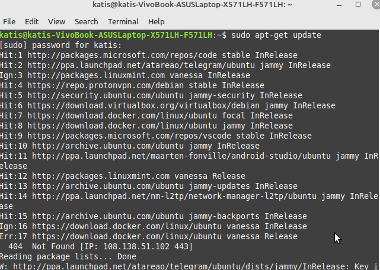
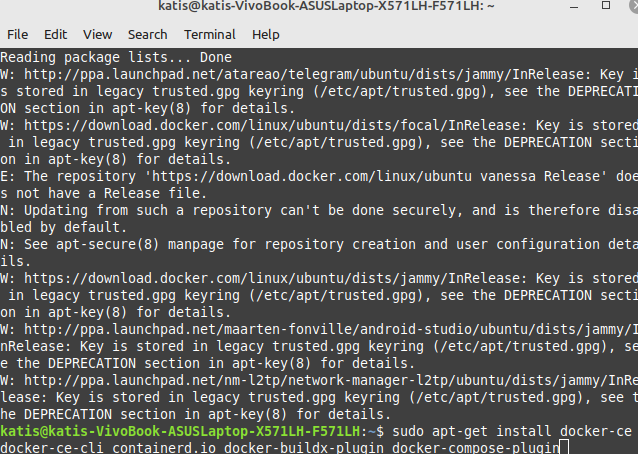
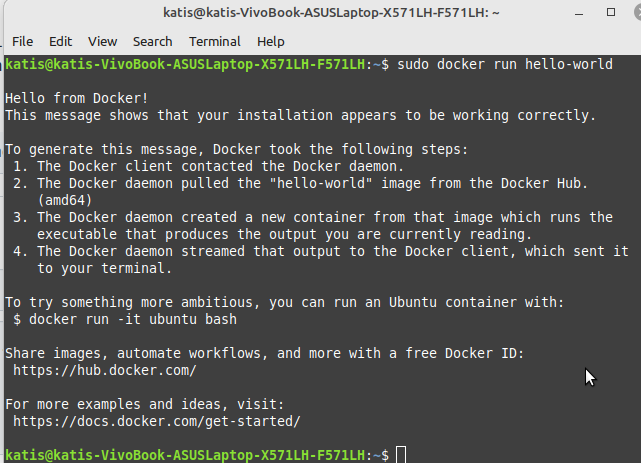
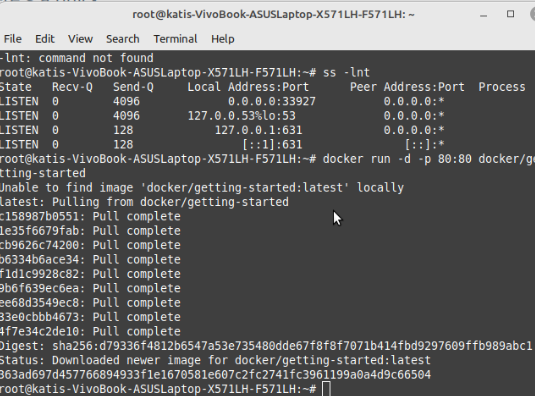
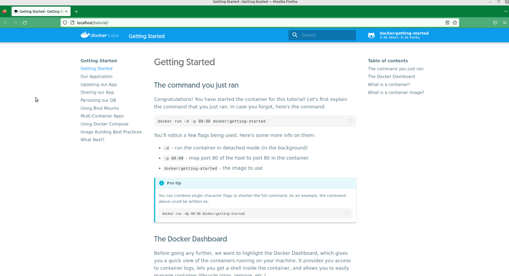
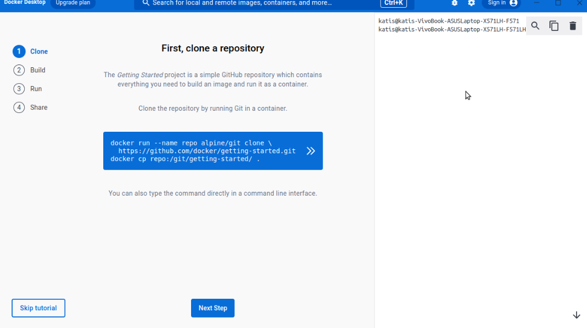
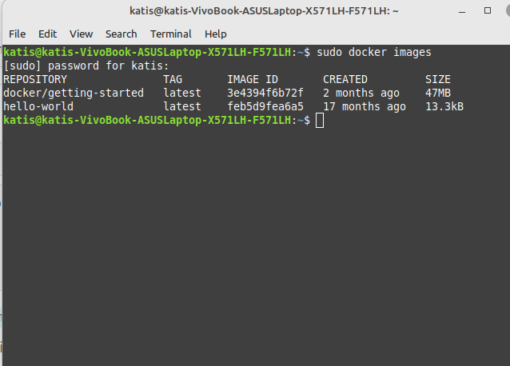

1. Install Docker Engine on Ubuntu

Update the apt package index and install packages to allow apt to use a repository over HTTPS:

 sudo apt-get update
 sudo apt-get install \
    ca-certificates \
    curl \
    gnupg \

Add Docker’s official GPG key:

sudo mkdir -m 0755 -p /etc/apt/keyrings
curl -fsSL https://download.docker.com/linux/ubuntu/gpg | sudo gpg --dearmor -o /etc/apt/keyrings/docker.gpg

Use the following command to set up the repository:

echo \
  "deb [arch=$(dpkg --print-architecture) signed-by=/etc/apt/keyrings/docker.gpg] https://download.docker.com/linux/ubuntu \
  $(lsb_release -cs) stable" | sudo tee /etc/apt/sources.list.d/docker.list > /dev/null
  

Update the apt package index:

sudo apt-get update

To install the latest version, run:

sudo apt-get install docker-ce docker-ce-cli containerd.io docker-buildx-plugin docker-compose-plugin

Verify that the Docker Engine installation is successful by running the hello-world image (This command downloads a test image and runs it in a container. When the container runs, it prints a confirmation message and exits):

sudo docker run hello-world

2. So, let's run a container. (As we haven't add a user to group, we have to write sudo or go to sudo mode using "sudo -i"):

sudo -i
docker run -d -p 80:80 docker/getting-started

3. Finally, go to the localhost:

4. Here is an instruction for downloading Docker Desktop. I've done it:

5. Useful commands:

sudo docker images

